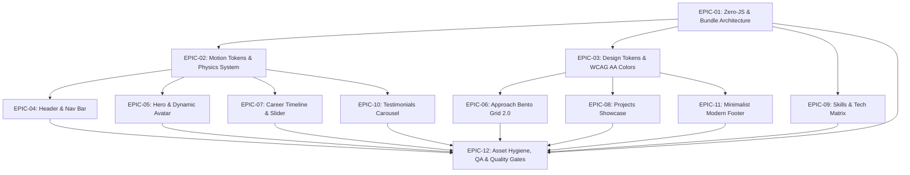

# 🚀 Roadmap & Task Breakdown: mirislamus.github.io /boost

> **Статус проекта:** Утверждённый план реализации и WBS (Work Breakdown Structure)  
> **Роли:** Senior Frontend Engineer / Lead UI/UX Designer  
> **Спецификация:** [Дизайн-манифест и техническое задание (/boost)](./boost-tz.md)  
> **Цель:** Трансформация персонального сайта-портфолио в инженерный продукт мирового уровня: архитектура Zero-JS (Astro Islands), физика пружинных анимаций, бескомпромиссная доступность (WCAG 2.1 AA) и премиальный UI/UX дизайн (Linear / Stripe style).

---

## 📑 Оглавление (Quick Navigation)

- [📊 1. Сводка и целевые метрики (Before vs After)](#-1-сводка-и-целевые-метрики-before-vs-after)
- [🗺️ 2. Архитектурные принципы /boost](#-2-архитектурные-принципы-boost)
- [🗂️ 3. Матрица эпиков (Mermaid)](#-3-матрица-эпиков-mermaid)
- [📦 4. Детализация задач по эпикам](#-4-детализация-задач-по-эпикам)
  - [EPIC-01: Zero-JS Architecture & Bundle Optimization](#epic-01-zero-js-architecture--bundle-optimization)
    - [TASK-01.1: Аудит и удаление неиспользуемых рантайм-зависимостей](#task-011-аудит-и-удаление-неиспользуемых-рантайм-зависимостей)
    - [TASK-01.2: Миграция Approach в нативный Astro и микро-остров копирования](#task-012-миграция-approach-в-нативный-astro-и-микро-остров-копирования)
    - [TASK-01.3: Замена Swiper и Sonner на нативные браузерные API](#task-013-замена-swiper-и-sonner-на-нативные-браузерные-api)
  - [EPIC-02: Motion Design System & Animation Physics Engine](#epic-02-motion-design-system--animation-physics-engine)
    - [TASK-02.1: Спецификация токенов пружинных анимаций в SCSS](#task-021-спецификация-токенов-пружинных-анимаций-в-scss)
    - [TASK-02.2: Разработка легковесного эффекта Spotlight и 3D-Tilt](#task-022-разработка-легковесного-эффекта-spotlight-и-3d-tilt)
    - [TASK-02.3: Магнитные кнопки и интерактивные курсорные привязки](#task-023-магнитные-кнопки-и-интерактивные-курсорные-привязки)
    - [TASK-02.4: Система Scroll-Driven анимаций и каскадный Stagger](#task-024-система-scroll-driven-анимаций-и-каскадный-stagger)
  - [EPIC-03: Visual Tokens, Themes & WCAG 2.1 AA Contrast](#epic-03-visual-tokens-themes--wcag-21-aa-contrast)
    - [TASK-03.1: Калибровка токена --accent-text и устранение нарушений контраста](#task-031-калибровка-токена---accent-text-и-устранение-нарушений-контраста)
    - [TASK-03.2: Синхронизация системной темы и гарантированное исключение FOUC](#task-032-синхронизация-системной-темы-и-гарантированное-исключение-fouc)
  - [EPIC-04: Header & Global Navigation System](#epic-04-header--global-navigation-system)
    - [TASK-04.1: Парящий стеклянный бар (Floating Island Glassmorphism) со smart-hide](#task-041-парящий-стеклянный-бар-floating-island-glassmorphism-со-smart-hide)
    - [TASK-04.2: Пружинный скользящий индикатор активного раздела](#task-042-пружинный-скользящий-индикатор-активного-раздела)
    - [TASK-04.3: Доводка шторки мобильного меню (Spring Drawer) и взаимное исключение](#task-043-доводка-шторки-мобильного-меню-spring-drawer-и-взаимное-исключение)
    - [TASK-04.4: Анимация морфинга тем (Sun/Moon) и выпадающий список языков](#task-044-анимация-морфинга-тем-sunmoon-и-выпадающий-список-языков)
  - [EPIC-05: Hero Section & Interactive Avatar](#epic-05-hero-section--interactive-avatar)
    - [TASK-05.1: Редизайн типографики Hero и радарный статус-бейдж "Available for work"](#task-051-редизайн-типографики-hero-и-радарный-статус-бейдж-available-for-work)
    - [TASK-05.2: Интерактивный живой аватар с 3D-параллаксом и контролем GSAP](#task-052-интерактивный-живой-аватар-с-3d-параллаксом-и-контролем-gsap)
  - [EPIC-06: Approach & Principles (Bento Grid 2.0)](#epic-06-approach--principles-bento-grid-20)
    - [TASK-06.1: Современная асимметричная сетка Bento Grid 2.0 с 1px border sheen](#task-061-современная-асимметричная-сетка-bento-grid-20-с-1px-border-sheen)
    - [TASK-06.2: Интерактивная песочница UI-компонентов (Карточка "UI/Craft")](#task-062-интерактивная-песочница-ui-компонентов-карточка-uicraft)
    - [TASK-06.3: Тактильная карточка копирования Email с морфингом иконок](#task-063-тактильная-карточка-копирования-email-с-морфингом-иконок)
    - [TASK-06.4: Превью кода Pomotomo с чистым CSS переключением тем без FOUC](#task-064-превью-кода-pomotomo-с-чистым-css-переключением-тем-без-fouc)
  - [EPIC-07: Career & Experience Timeline](#epic-07-career--experience-timeline)
    - [TASK-07.1: Разработка Native CSS Scroll-Snap таймлайна](#task-071-разработка-native-css-scroll-snap-таймлайна)
    - [TASK-07.2: Визуальный редизайн карточек карьеры и светящаяся линия прогресса](#task-072-визуальный-редизайн-карточек-карьеры-и-светящаяся-линия-прогресса)
  - [EPIC-08: Projects Showcase & Case Studies](#epic-08-projects-showcase--case-studies)
    - [TASK-08.1: Редизайн карточек проектов (16:9 Cinematic Preview & Depth Hover)](#task-081-редизайн-карточек-проектов-169-cinematic-preview--depth-hover)
    - [TASK-08.2: Мгновенное раскрытие проектов "Show More" без задержек и скелетонов](#task-082-мгновенное-раскрытие-проектов-show-more-без-задержек-и-скелетонов)
  - [EPIC-09: Skills & Technical Matrix](#epic-09-skills--technical-matrix)
    - [TASK-09.1: Категоризация матрицы навыков по 4 доменам и удаление шума](#task-091-категоризация-матрицы-навыков-по-4-доменам-и-удаление-шума)
    - [TASK-09.2: Интерактивная подсветка навыков и связь со стеком проектов](#task-092-интерактивная-подсветка-навыков-и-связь-со-стеком-проектов)
  - [EPIC-10: Testimonials & Social Proof](#epic-10-testimonials--social-proof)
    - [TASK-10.1: Native CSS Carousel для отзывов с пагинацией](#task-101-native-css-carousel-для-отзывов-с-пагинацией)
    - [TASK-10.2: Оформление карточек рекомендаций и верификация](#task-102-оформление-карточек-рекомендаций-и-верификация)
  - [EPIC-11: Modern Minimalist Footer & Contacts](#epic-11-modern-minimalist-footer--contacts)
    - [TASK-11.1: Редизайн финального блока CTA и магнитные контакты](#task-111-редизайн-финального-блока-cta-и-магнитные-контакты)
    - [TASK-11.2: Виджет реального времени разработчика (Tashkent UTC+5)](#task-112-виджет-реального-времени-разработчика-tashkent-utc5)
    - [TASK-11.3: Плавающая кнопка "Наверх" с круговым SVG Progress Ring](#task-113-плавающая-кнопка-наверх-с-круговым-svg-progress-ring)
  - [EPIC-12: Asset Hygiene, Accessibility, SEO & Quality Gates](#epic-12-asset-hygiene-accessibility-seo--quality-gates)
    - [TASK-12.1: Очистка неиспользуемых ассетов (SF Pro, zustand.svg, JPG)](#task-121-очистка-неиспользуемых-ассетов-sf-pro-zustand-svg-jpg)
    - [TASK-12.2: Полный аудит клавиатурной навигации и экранных ридеров](#task-122-полный-аудит-клавиатурной-навигации-и-экранных-ридеров)
    - [TASK-12.3: Микроразметка JSON-LD (Person/ProfilePage) и социальные метатеги](#task-123-микроразметка-json-ld-person-profilepage-и-социальные-метатеги)
    - [TASK-12.4: Настройка Quality Gates и CI-скриптов проверки бандла](#task-124-настройка-quality-gates-и-ci-скриптов-проверки-бандла)
- [🗓️ 5. План реализации по спринтам (Sprint Schedule)](#-5-план-реализации-по-спринтам-sprint-schedule)
- [🎯 6. Definition of Done (DoD) для каждого релиза](#-6-definition-of-done-dod-для-каждого-релиза)

---

## 📊 1. Сводка и целевые метрики (Before vs After)

| Метрика / Параметр | Текущее состояние (As-Is) | Целевой ориентир (/boost To-Be) | Обоснование / Инструменты |
| :--- | :--- | :--- | :--- |
| **Стартовый JS (Transfer Gzip)** | **~171 КБ** (495 КБ raw) | **< 35 КБ** gzip | Удаление Motion, Swiper, Sonner; де-гидратация в чистый Astro + CSS |
| **Lighthouse Performance (Mobile)** | ~85–92 | **98–100** | Исключение блокирующих скриптов, оптимизация LCP и CLS |
| **LCP (Largest Contentful Paint)** | ~1.4–1.8 с | **< 0.8 с** | Чистый HTML-рендер первого экрана, предзагрузка критических шрифтов |
| **CLS (Cumulative Layout Shift)** | Риск при догрузке картинок | **0.000** | Фиксированные `aspect-ratio` и intrinsic sizes на всех медиа |
| **INP (Interaction to Next Paint)** | ~120–180 мс | **< 30 мс** | Нет тяжелых React-деревьев в основном потоке ввода |
| **Доступность (Axe-core Violations)** | 23 нарушения контраста в light theme | **0 violations (100% WCAG AA)** | Коррекция `--accent-text: #c84010`, фокус-трап, ARIA-семантика |
| **Неиспользуемые ассеты в сборке** | ~387 КБ (SF Pro) + 137 КБ (`zustand.svg`) | **0 КБ мертвого веса** | Удаление неиспользуемых шрифтов, сжатие SVGO |
| **Библиотеки анимаций** | GSAP MorphSVG + Motion (unused) + Swiper | **CSS-first + Spring tokens** (GSAP изолирован в dynamic import) |
| **Поддержка `prefers-reduced-motion`** | Базовая | **100% системная** (без зацикленных эффектов, мгновенные состояния) |

---

## 🗺️ 2. Архитектурные принципы /boost

1. **Zero-JS by Default (Astro Islands):**
   - Компоненты [Hero.astro](../src/widgets/components/Hero/Hero.astro), [Skills.astro](../src/widgets/components/Skills/Skills.astro) и [Footer.astro](../src/widgets/components/Footer/Footer.astro) уже переведены на Astro.
   - Оставшиеся React-острова ([Approach.tsx](../src/widgets/components/Approach/Approach.tsx), [Career.tsx](../src/widgets/components/Career/Career.tsx), [Projects.tsx](../src/widgets/components/Projects/Projects.tsx), [Reviews.tsx](../src/widgets/components/Reviews/Reviews.tsx)) переводятся на нативный HTML/CSS, нативный CSS Scroll-Snap и легковесные микро-острова.
2. **Natural Spring Motion (Физика естественных движений):**
   - Отказ от линейных `ease-in` в пользу выверенных пружин (`cubic-bezier(0.16, 1, 0.3, 1)` для мягкого торможения и `cubic-bezier(0.34, 1.56, 0.64, 1)` для микро-откликов).
   - Тактильный отклик (haptic visual feedback): магнитные кнопки, 3D tilt карточек со световым бликом (specular highlight), плавное скольжение активных индикаторов.
3. **Бескомпромиссная типографика и сетка:**
   - Bento Grid 2.0 с динамической толщиной линий (1px border sheen), адаптивная модульная шкала через `clamp()`.
   - Семантическая иерархия без пропусков заголовков (`h1` → `h2` → `h3`).
4. **Синхронизация с системой и платформами:**
   - Нативная синхронизация `color-scheme` и метатегов `theme-color`.
   - Поддержка трех языков (EN, RU, UZ) с синхронным переключением без перезагрузки через View Transitions API.

---

## 🗂️ 3. Матрица эпиков (Mermaid)



---

## 📦 4. Детализация задач по эпикам

---

### EPIC-01: Zero-JS Architecture & Bundle Optimization
**Цель:** Сократить стартовый клиентский бандл со 171 КБ gzip до < 35 КБ gzip путем устранения лишних зависимостей и перевода компонентов на нативные браузерные стандарты.

#### TASK-01.1: Аудит и удаление неиспользуемых рантайм-зависимостей
- **Приоритет:** P0 (Блокирующий)
- **Оценка:** S (2 ч)
- **Файлы:** [package.json](../package.json), [bun.lock](../bun.lock), [src/shared/ui/LazyMotionWrapper.tsx](../src/shared/ui/LazyMotionWrapper.tsx), [src/shared/ui/animations/RotatingText/](../src/shared/ui/animations/RotatingText/)
- **Текущий статус (As-Is):** В проекте установлены `motion` (Framer Motion v12, ~75 КБ) и `@gsap/react`. Компонент `RotatingText.tsx` и обертка `LazyMotionWrapper.tsx` не используются на страницах сайта, но находятся в кодовой базе и могут попадать в бандл.
- **Что сделать:**
  1. Удалить зависимости `motion` и `@gsap/react` из `package.json`.
  2. Удалить неиспользуемые компоненты `src/shared/ui/LazyMotionWrapper.tsx` и `src/shared/ui/animations/RotatingText/`.
  3. Оставить чистый `gsap` исключительно для динамического импорта аватара.
  4. Проверить чистоту дерева зависимостей командой `bun run build`.
- **Критерии приёмки (DoD):**
  - [ ] `package.json` не содержит `motion` и `@gsap/react`.
  - [ ] `bun run check` и `bun run build` завершаются без ошибок.
  - [ ] Общий объем бандла уменьшен минимум на ~30 КБ gzip.

#### TASK-01.2: Миграция Approach в нативный Astro и микро-остров копирования
- **Приоритет:** P0
- **Оценка:** M (4 ч)
- **Файлы:** [src/widgets/components/Approach/Approach.tsx](../src/widgets/components/Approach/Approach.tsx), [src/pages/[...lang]/index.astro](../src/pages/[...lang]/index.astro)
- **Текущий статус (As-Is):** `Approach.tsx` подключен как `client:visible`, из-за чего на клиенте гидрируется тяжелое React-дерево, хотя секция представляет собой статическую bento-сетку с одной кнопкой копирования email и переключением картинки кода.
- **Что сделать:**
  1. Переписать `Approach.tsx` в `Approach.astro`.
  2. Для картинок кода темы (`code-light.png` / `code-dark.png`) использовать нативную CSS-структуру с селектором `[data-theme]`, исключив флаг `isHydrated` и React-стейт.
  3. Выделить интерактивную кнопку копирования в ультралегкий компонент `CopyEmailButton` (нативный Web Component `<copy-email>` или микро-скрипт ~25 строк), не гидрируя всю секцию.
  4. Заменить `StarBorder.tsx` на чистый CSS-класс без React-обертки.
- **Критерии приёмки (DoD):**
  - [ ] `Approach` рендерится как чистый Astro-компонент без клиентского рантайма React для всей секции.
  - [ ] Вкладка Network при загрузке не содержит чанков `Approach.*.js`.
  - [ ] Картинка кода отображается мгновенно без FOUC и задержек гидратации.

#### TASK-01.3: Замена Swiper и Sonner на нативные браузерные API
- **Приоритет:** P1
- **Оценка:** L (6 ч)
- **Файлы:** [src/widgets/components/Career/Career.tsx](../src/widgets/components/Career/Career.tsx), [src/widgets/components/Reviews/Reviews.tsx](../src/widgets/components/Reviews/Reviews.tsx), [src/shared/ui/ToastProvider/ToastProvider.tsx](../src/shared/ui/ToastProvider/ToastProvider.tsx)
- **Текущий статус (As-Is):** `swiper` (`85.4 КБ raw` / `26.6 КБ gzip`) и `sonner` (`33.7 КБ raw` / `9.5 КБ gzip`) создают основной вес клиентского JS. Горизонтальный скролл и всплывающие уведомления легко решаются нативным CSS Scroll-Snap и 1 КБ скрипта.
- **Что сделать:**
  1. Заменить Swiper в `Career` на нативный горизонтальный контейнер с `scroll-snap-type: x mandatory` и кнопками скролла `scrollBy({ left: ... , behavior: 'smooth' })`.
  2. Заменить Swiper в `Reviews` на аналогичный доступный CSS scroll-snap слайдер с точками-индикаторами.
  3. Заменить Sonner на легковесный тостер на базе нативного `<dialog>` или кастомного микро-элемента (~40 строк кода, 0.8 КБ).
- **Критерии приёмки (DoD):**
  - [ ] Пакеты `swiper` и `sonner` полностью удалены из клиентских чанков.
  - [ ] Слайдеры Career и Reviews работают плавно, поддерживают touch-свайпы и клавиатурные стрелки.
  - [ ] Всплывающий toast при копировании email работает надежно без сторонних библиотек.

---

### EPIC-02: Motion Design System & Animation Physics Engine
**Цель:** Создать единую дизайн-систему движения с естественной физикой (пружины, демпфирование, инерция), микро-взаимодействиями и строгой поддержкой `prefers-reduced-motion`.

#### TASK-02.1: Спецификация токенов пружинных анимаций в SCSS
- **Приоритет:** P1
- **Оценка:** S (2 ч)
- **Файлы:** [src/styles/helpers/_variables.scss](../src/styles/helpers/_variables.scss), [src/styles/helpers/_animations.scss](../src/styles/helpers/_animations.scss)
- **Текущий статус (As-Is):** В `_variables.scss` задан примитивный `--transition: 0.25s ease-in;`, что дает визуально резкий, неестественный отклик при наведении.
- **Что сделать:**
  1. Внедрить набор CSS-кривых для разных типов интерфейсных событий:
     - `--ease-spring-soft: cubic-bezier(0.16, 1, 0.3, 1);` (для плавных появлений и дропдаунов).
     - `--ease-spring-snappy: cubic-bezier(0.2, 0.8, 0.2, 1);` (для кнопок и переключателей).
     - `--ease-spring-bounce: cubic-bezier(0.34, 1.56, 0.64, 1);` (для микро-акцентов и иконок).
     - `--ease-out-expo: cubic-bezier(0.19, 1, 0.22, 1);` (для быстрого выхода).
  2. Определить длительности: `--duration-fast: 150ms;`, `--duration-base: 280ms;`, `--duration-slow: 450ms;`.
  3. Настроить глобальный media-запрос `@media (prefers-reduced-motion: reduce)` для мгновенного отключения транзишенов и зацикленных анимаций.
- **Критерии приёмки (DoD):**
  - [ ] Все интерактивные компоненты используют токены `--ease-spring-*`.
  - [ ] При включенном `prefers-reduced-motion` анимации переходят в дискретное состояние без задержек.

#### TASK-02.2: Разработка легковесного эффекта Spotlight и 3D-Tilt
- **Приоритет:** P1
- **Оценка:** M (4 ч)
- **Файлы:** [src/shared/ui/animations/Spotlight/](../src/shared/ui/animations/Spotlight/), [src/widgets/components/Projects/](../src/widgets/components/Projects/), [src/widgets/components/Approach/](../src/widgets/components/Approach/)
- **Текущий статус (As-Is):** Текущий `Spotlight.tsx` привязан к React и пересчитывает координаты через React event handler, вызывая лишние перерендеры.
- **Что сделать:**
  1. Реализовать Vanilla JS / CSS Custom Properties контроллер для карточек: отслеживание координат курсора через `requestAnimationFrame` с интерполяцией (lerp) для плавности.
  2. Добавить тонкий световой блик (specular sheen) по контуру границы (1px border gradient, следующий за курсором).
  3. Добавить микро-наклон (tilt) в 3D пространстве (`perspective(1000px) rotateX(...) rotateY(...)`) не более 4–6 градусов с плавным возвратом.
  4. На touch-экранах автоматически отключать расчет курсора.
- **Критерии приёмки (DoD):**
  - [ ] Карточки проектов и бенто плавно реагируют на движение курсора с частотой 60/120 FPS.
  - [ ] Нет просадок FPS и вызовов сборщика мусора.
  - [ ] Эффект полностью отключается при touch-вводе и `prefers-reduced-motion`.

#### TASK-02.3: Магнитные кнопки и интерактивные курсорные привязки
- **Приоритет:** P2
- **Оценка:** M (3 ч)
- **Файлы:** [src/shared/ui/Button/Button.tsx](../src/shared/ui/Button/Button.tsx), [src/widgets/components/Header/Header.tsx](../src/widgets/components/Header/Header.tsx), [src/widgets/components/Hero/Hero.astro](../src/widgets/components/Hero/Hero.astro)
- **Текущий статус (As-Is):** Кнопки статичны при наведении и не создают ощущения физического объекта.
- **Что сделать:**
  1. Разработать директиву/контроллер `magnetic`: при приближении курсора к кнопке в радиусе 30px кнопка плавно смещается навстречу курсору (до 6-8px смещения с демпфированием).
  2. Текст/иконка внутри кнопки смещаются с небольшим параллаксом (на 2-3px больше).
  3. При отведении мыши — возврат на исходную позицию с затухающим колебанием.
- **Критерии приёмки (DoD):**
  - [ ] Главная CTA-кнопка в Hero и переключатели в Header обладают приятным магнитным эффектом.
  - [ ] Смещение жестко ограничено безопасной зоной (clamped), кнопка не "улетает" за курсором.

#### TASK-02.4: Система Scroll-Driven анимаций и каскадный Stagger
- **Приоритет:** P2
- **Оценка:** M (3 ч)
- **Файлы:** [src/styles/helpers/_animations.scss](../src/styles/helpers/_animations.scss), [src/layouts/Layout.astro](../src/layouts/Layout.astro)
- **Что сделать:**
  1. Использовать современный CSS `@supports (animation-timeline: view())` для нативных scroll-driven анимаций (постепенное проявление карточек, движение линии таймлайна в Career).
  2. В качестве fallback для браузеров без поддержки — один глобальный `IntersectionObserver`, навешивающий класс `is-revealed`.
  3. Спецификация анимации: `translateY(24px) → translateY(0)`, `opacity: 0 → 1`, каскадный stagger-эффект для элементов списков (+60ms на каждый следующий элемент).
- **Критерии приёмки (DoD):**
  - [ ] При прокрутке страницы контент плавно проявляется порциями.
  - [ ] Нет скачков макета (CLS = 0).

---

### EPIC-03: Visual Tokens, Themes & WCAG 2.1 AA Contrast
**Цель:** Устранить все подтвержденные нарушения контрастности в светлой теме, внедрить бесшовную смену тем без мерцания (FOUC) и выровнять дизайн-токены.

#### TASK-03.1: Калибровка токена --accent-text и устранение нарушений контраста
- **Приоритет:** P0 (Блокирующий доступность)
- **Оценка:** S (2 ч)
- **Файлы:** [src/styles/helpers/_variables.scss](../src/styles/helpers/_variables.scss), SCSS-модули компонентов
- **Текущий статус (As-Is):** Токен `--accent-text: #ff6433;` уже присутствует в `_variables.scss`, однако его контраст на белом фоне составляет лишь **2.96:1** (норма WCAG AA — минимум 4.5:1). В ряде компонентов стили продолжают напрямую обращаться к `--accent` и `--grey-4` вместо семантических текстовых токенов.
- **Что сделать:**
  1. Откалибровать значение `--accent-text` в светлой теме: заменить `#ff6433` на `#c84010` (контраст **5.03:1** на белом — проходит WCAG AA).
  2. Заменить прямое использование `--accent` в текстах на `--accent-text`.
  3. Проверить `--text-muted`: в светлой теме использовать `#595959` (контраст **7.0:1**, уровень AAA).
  4. На кнопках с заливкой использовать контрастный темный текст `--accent-contrast: var(--black);`.
- **Критерии приёмки (DoD):**
  - [ ] Axe-core показывает 0 violations по правилу `color-contrast` на всех страницах (`/`, `/ru/`, `/uz/`) в обеих темах.
  - [ ] Дизайн сохраняет узнаваемый фирменный теплый стиль.

#### TASK-03.2: Синхронизация системной темы и гарантированное исключение FOUC
- **Приоритет:** P1
- **Оценка:** S (2 ч)
- **Файлы:** [src/layouts/Layout.astro](../src/layouts/Layout.astro), [src/utils/theme.ts](../src/utils/theme.ts), [src/layouts/Head.astro](../src/layouts/Head.astro)
- **Текущий статус (As-Is):** CSS `color-scheme` уже добавлен в `_variables.scss`, однако метатег `meta[name="theme-color"]` в `theme.ts` обновляется только для одного элемента и требует проверки при переключении OS theme без перезагрузки.
- **Что сделать:**
  1. Убедиться, что в `theme.ts` динамически обновляются все теги `meta[name="theme-color"]` на `#121212` (dark) и `#ffffff` (light).
  2. Проверить блокирующий инлайн-скрипт в `<head>`, читающий `localStorage` до отрисовки body для 100% исключения белой вспышки ночью.
- **Критерии приёмки (DoD):**
  - [ ] Системный скроллбар браузера и нативные контролы соответствуют активной теме.
  - [ ] При перезагрузке страницы отсутствует визуальное мерцание темы.

---

### EPIC-04: Header & Global Navigation System
**Цель:** Создать современный плавающий "floating island" хедер с физикой скольжения активного пункта, идеальным мобильным меню и быстрым переключателем языка.

#### TASK-04.1: Парящий стеклянный бар (Floating Island Glassmorphism) со smart-hide
- **Приоритет:** P1
- **Оценка:** M (3 ч)
- **Файлы:** [src/widgets/components/Header/Header.tsx](../src/widgets/components/Header/Header.tsx), [src/widgets/components/Header/Header.module.scss](../src/widgets/components/Header/Header.module.scss)
- **Что сделать:**
  1. Превратить хедер в парящий капсульный бар с отступом от верха страницы (`top: 16px; margin: 0 auto; max-width: 1040px; border-radius: 9999px;`).
  2. Использовать премиальное размытие: `backdrop-filter: blur(16px) saturate(180%);`, фон `rgba(var(--bg-rgb), 0.75)`, тонкая граница `1px solid rgba(255, 255, 255, 0.08)`.
  3. Добавить логику "умного скрытия": при скролле вниз хедер мягко убирается наверх (`translateY(-120%)`), при скролле вверх — плавно возвращается.
- **Критерии приёмки (DoD):**
  - [ ] Хедер парит над контентом с размытием фона.
  - [ ] Скролл-поведение плавное, без скачков.

#### TASK-04.2: Пружинный скользящий индикатор активного раздела
- **Приоритет:** P1
- **Оценка:** S (2 ч)
- **Файлы:** [src/widgets/components/Header/Header.tsx](../src/widgets/components/Header/Header.tsx), [src/widgets/components/Header/Header.module.scss](../src/widgets/components/Header/Header.module.scss)
- **Что сделать:**
  1. Заменить текущую тонкую линию под пунктом на полупрозрачную подложку-пилюлю (pill active state) за текстом.
  2. Анимировать перемещение пилюли между пунктами при помощи CSS `transition: transform 300ms var(--ease-spring-snappy), width 300ms var(--ease-spring-snappy)`.
  3. Синхронизировать с IntersectionObserver активной секции страницы.
- **Критерии приёмки (DoD):**
  - [ ] При клике или скролле активная плашка плавно "перетекает" от пункта к пункту без задержки.

#### TASK-04.3: Доводка шторки мобильного меню (Spring Drawer) и взаимное исключение
- **Приоритет:** P0
- **Оценка:** M (3 ч)
- **Файлы:** [src/widgets/components/Header/Header.tsx](../src/widgets/components/Header/Header.tsx), [src/widgets/components/Header/Header.module.scss](../src/widgets/components/Header/Header.module.scss)
- **Текущий статус (As-Is):** Базовый Focus Trap, поддержка `Escape`, `inert` на `<main>` и `overflow: hidden` уже реализованы в `Header.tsx`. Однако шторка открывается плоско, оверлей не имеет размытия, а при открытии мобильного меню выпадающий список языков может оставаться открытым.
- **Что сделать:**
  1. Реализовать анимацию появления шторки выездом справа с эффектом мягкой пружины (`var(--ease-spring-soft)`) и размытием оверлея (`backdrop-filter: blur(8px)`).
  2. Обеспечить строгое взаимное исключение: при открытии мобильного меню принудительно закрывать селектор языков, и наоборот.
  3. Добавить корректный атрибут `aria-controls` и связать кнопку меню с контейнером навигации.
- **Критерии приёмки (DoD):**
  - [ ] Плавный выезд шторки на мобильных устройствах.
  - [ ] Меню и переключатель языка взаимно закрывают друг друга.
  - [ ] Полное отсутствие скролла фона при открытом меню.

#### TASK-04.4: Анимация морфинга тем (Sun/Moon) и выпадающий список языков
- **Приоритет:** P2
- **Оценка:** S (2 ч)
- **Файлы:** [src/widgets/components/Header/Header.tsx](../src/widgets/components/Header/Header.tsx), [src/shared/ui/ActionButton/ActionButton.tsx](../src/shared/ui/ActionButton/ActionButton.tsx)
- **Что сделать:**
  1. При смене темы анимировать вращение и масштабирование иконок Sun/Moon (`rotate(360deg) scale(0) → scale(1)`).
  2. Выпадающий список языков: появление с легким масштабированием (`scale(0.95) → scale(1)`) и навигацией стрелками `ArrowUp` / `ArrowDown` с клавиатуры.
- **Критерии приёмки (DoD):**
  - [ ] Плавные микровзаимодействия при клике на контролы хедера.

---

### EPIC-05: Hero Section & Interactive Avatar
**Цель:** Создать выразительный первый экран с сильной типографикой, статусом доступности к найму и органичным живым аватаром.

#### TASK-05.1: Редизайн типографики Hero и радарный статус-бейдж "Available for work"
- **Приоритет:** P1
- **Оценка:** S (2 ч)
- **Файлы:** [src/widgets/components/Hero/Hero.astro](../src/widgets/components/Hero/Hero.astro), [src/widgets/components/Hero/Hero.module.scss](../src/widgets/components/Hero/Hero.module.scss)
- **Что сделать:**
  1. Добавить над именем интерактивный статус-бейдж: зеленая пульсирующая точка (радарный pulse-эффект) + текст "Available for new projects" / "Открыт к предложениям".
  2. Сделать заголовок крупным и выразительным с градиентным акцентом на роли `Frontend Engineer`.
  3. Добавить микро-строку с ключевыми ценностями: "Specializing in React, Next.js, Performance & Design Systems".
- **Критерии приёмки (DoD):**
  - [ ] Первый экран визуально производит впечатление уверенного Senior/Lead инженера.
  - [ ] Пульсация точки аккуратная, не раздражает периферическое зрение.

#### TASK-05.2: Интерактивный живой аватар с 3D-параллаксом и контролем GSAP
- **Приоритет:** P1
- **Оценка:** M (4 ч)
- **Файлы:** [src/shared/ui/Avatar/Avatar.tsx](../src/shared/ui/Avatar/Avatar.tsx), [src/shared/ui/Avatar/Avatar.module.scss](../src/shared/ui/Avatar/Avatar.module.scss)
- **Текущий статус (As-Is):** Аватар загружает GSAP MorphSVG при старте страницы, таймлайн не засыпает при уходе из viewport.
- **Что сделать:**
  1. Загружать GSAP MorphSVG **только** после проверки `prefers-reduced-motion: no-preference` и только при вхождении аватара во viewport.
  2. При движении курсора по Hero аватар слегка поворачивается в 3D (параллакс слоя фото относительно формы маски).
  3. Добавить за аватаром мягкое градиентное свечение (ambient glow halo), слегка переливающееся фирменными цветами.
  4. При отключении анимаций показывать элегантную статичную скругленную органическую маску.
- **Критерии приёмки (DoD):**
  - [ ] 0 утечек памяти, таймлайн GSAP засыпает при уходе из viewport.
  - [ ] Плавный 3D параллакс взгляда/аватара за курсором.

---

### EPIC-06: Approach & Principles (Bento Grid 2.0)
**Цель:** Превратить блок "Подход к работе" в демонстрацию технического мастерства фронтенд-инженера через интерактивные бенто-карточки.

#### TASK-06.1: Современная асимметричная сетка Bento Grid 2.0 с 1px border sheen
- **Приоритет:** P1
- **Оценка:** M (4 ч)
- **Файлы:** [src/widgets/components/Approach/Approach.astro](../src/widgets/components/Approach/Approach.astro), [src/widgets/components/Approach/Approach.module.scss](../src/widgets/components/Approach/Approach.module.scss)
- **Что сделать:**
  1. Перестроить сетку на 12-колоночный CSS Grid с переменной высотой и четкой иерархией карточек.
  2. Границы карточек оформить в виде 1px полупрозрачного градиента (`border: 1px solid rgba(255,255,255,0.08)` с переливом при hover).
  3. Заменить жесткие `h4` на семантические `h3`.
- **Критерии приёмки (DoD):**
  - [ ] Премиальный визуальный стиль дорогого B2B/SaaS продукта (Stripe / Linear / Vercel style).
  - [ ] Безупречная адаптивность на 390px, 768px, 1024px и 1440px.

#### TASK-06.2: Интерактивная песочница UI-компонентов (Карточка "UI/Craft")
- **Приоритет:** P2
- **Оценка:** M (4 ч)
- **Файлы:** [src/widgets/components/Approach/Approach.astro](../src/widgets/components/Approach/Approach.astro), [src/widgets/components/Approach/Approach.module.scss](../src/widgets/components/Approach/Approach.module.scss)
- **Текущий статус (As-Is):** Карточка UI содержит статичную плоскую SVG-картинку макета.
- **Что сделать:**
  1. Заменить статичную SVG на миниатюрный интерактивный UI-виджет:
     - Рабочий тумблер (toggle switch) с тактильным щелчком.
     - Интерактивный ползунок (slider) с плавной сменой процента/значения.
     - Мини-карточка с индикатором загрузки или пульсирующим бейджем.
  2. Все микро-компоненты работают на чистом CSS / легком vanilla скрипте без сторонних библиотек.
- **Критерии приёмки (DoD):**
  - [ ] Посетитель может взаимодействовать с элементами прямо в карточке.

#### TASK-06.3: Тактильная карточка копирования Email с морфингом иконок
- **Приоритет:** P1
- **Оценка:** S (2 ч)
- **Файлы:** [src/widgets/components/Approach/CopyEmailButton.astro](../src/widgets/components/Approach/CopyEmailButton.astro), [src/widgets/components/Approach/Approach.module.scss](../src/widgets/components/Approach/Approach.module.scss)
- **Что сделать:**
  1. Сделать кнопку копирования магнитной с плавной индикацией состояния.
  2. При клике: иконка `Copy` плавно трансформируется в зеленую галочку `Check` (`scale(0) → scale(1)`), текст меняется на "Скопировано!".
  3. Через 2.5 секунды состояние мягко сбрасывается обратно.
  4. Доступность: атрибут `aria-live="polite"` уведомляет скринридер об успешном копировании.
- **Критерии приёмки (DoD):**
  - [ ] Копирование работает во всех браузерах (включая fallback).
  - [ ] Визуальный отклик мгновенный и понятный.

#### TASK-06.4: Превью кода Pomotomo с чистым CSS переключением тем без FOUC
- **Приоритет:** P1
- **Оценка:** S (2 ч)
- **Файлы:** [src/widgets/components/Approach/Approach.astro](../src/widgets/components/Approach/Approach.astro)
- **Текущий статус (As-Is):** Ранее использовался хук `useIsHydrated()` и React-стейт, из-за чего картинка кода мигала при первой загрузке.
- **Что сделать:**
  1. Использовать нативную разметку:
     ```html
     <picture class="code-preview">
       
       
     </picture>
     ```
  2. В CSS управлять видимостью через селектор корневой темы:
     `[data-theme='light'] .theme-dark-img { display: none; }`
     `[data-theme='dark'] .theme-light-img { display: none; }`
- **Критерии приёмки (DoD):**
  - [ ] 0 мс задержки при переключении темы, картинка меняется мгновенно без JS.

---

### EPIC-07: Career & Experience Timeline
**Цель:** Превратить опыт работы в интерактивный сторителлинг с плавным скролл-слайдером без тяжелого Swiper.

#### TASK-07.1: Разработка Native CSS Scroll-Snap таймлайна
- **Приоритет:** P1
- **Оценка:** M (4 ч)
- **Файлы:** [src/widgets/components/Career/Career.astro](../src/widgets/components/Career/Career.astro), [src/widgets/components/Career/Career.module.scss](../src/widgets/components/Career/Career.module.scss)
- **Текущий статус (As-Is):** Swiper весит более 85 КБ и подключает тяжелые внешние стили.
- **Что сделать:**
  1. Реализовать горизонтальный скролл-контейнер на CSS: `scroll-snap-type: x mandatory; -webkit-overflow-scrolling: touch;`.
  2. Добавить легкий скрипт (менее 1 КБ) для синхронизации кнопок "Вперед/Назад" и обновления их атрибута `disabled` через `IntersectionObserver` крайних слайдов.
  3. Добавить клавиатурную навигацию: стрелки влево/вправо при фокусе внутри секции переключают шаги карьеры.
- **Критерии приёмки (DoD):**
  - [ ] Слайдер работает идентично Swiper, но с нулевым весом сторонних JS-библиотек.
  - [ ] Доступность: объявление номеров слайдов и корректные aria-кнопки.

#### TASK-07.2: Визуальный редизайн карточек карьеры и светящаяся линия прогресса
- **Приоритет:** P2
- **Оценка:** M (3 ч)
- **Файлы:** [src/widgets/components/Career/Career.module.scss](../src/widgets/components/Career/Career.module.scss), [src/data/career/career.json](../src/data/career/career.json)
- **Что сделать:**
  1. Добавить светящуюся линию таймлайна с точками-маркерами, которые активируются и мягко пульсируют при скролле.
  2. Структурировать текст каждой позиции:
     - Компания + Период + Роль.
     - Ключевые достижения (краткие буллет-поинты вместо сплошного текста).
     - Стек технологий в виде стильных капсульных тегов с микро-эффектом свечения при ховере.
  3. Привести дату текущего места к единому стандарту: `2024 — Present` / `2024 — настоящее время` / `2024 — hozir`.
- **Критерии приёмки (DoD):**
  - [ ] Четкая, легко сканируемая глазами структура карьерного пути.

---

### EPIC-08: Projects Showcase & Case Studies
**Цель:** Создать витрину проектов премиального уровня с кинематографичными превью, информативными метриками роли и плавной подгрузкой.

#### TASK-08.1: Редизайн карточек проектов (16:9 Cinematic Preview & Depth Hover)
- **Приоритет:** P1
- **Оценка:** M (4 ч)
- **Файлы:** [src/widgets/components/Projects/Projects.astro](../src/widgets/components/Projects/Projects.astro), [src/widgets/components/Projects/Projects.module.scss](../src/widgets/components/Projects/Projects.module.scss)
- **Что сделать:**
  1. Закрепить точное соотношение сторон превью `aspect-ratio: 16 / 9;` для устранения CLS.
  2. Добавить эффект при ховере: плавное увеличение изображения (`scale(1.04)`), подъем карточки на 4px, усиление светового контура.
  3. В карточку добавить метки роли: например, `Lead Frontend`, `Turnkey Development`, `Performance Optimization`.
  4. Отображать ссылки на Live Demo и Source Code (если доступно) с аккуратными иконками со стрелкой под углом 45 градусов.
- **Критерии приёмки (DoD):**
  - [ ] Карточки выглядят современно и премиально.
  - [ ] Отсутствуют скачки верстки при ленивой загрузке изображений.

#### TASK-08.2: Мгновенное раскрытие проектов "Show More" без задержек и скелетонов
- **Приоритет:** P1
- **Оценка:** S (2 ч)
- **Файлы:** [src/widgets/components/Projects/Projects.astro](../src/widgets/components/Projects/Projects.astro), [src/widgets/components/Projects/Projects.module.scss](../src/widgets/components/Projects/Projects.module.scss)
- **Текущий статус (As-Is):** Кнопка "Показать еще" вызывает искусственный `setTimeout` на 500 мс с показом `ProjectSkeleton`, что ухудшает UX и требует лишнего React-состояния.
- **Что сделать:**
  1. Рендерить все 8 проектов в HTML сразу на этапе сборки.
  2. Первые 4 проекта отображать по умолчанию, оставшиеся 4 скрывать через CSS-класс или атрибут `hidden`.
  3. При клике на "Показать ещё": убирать скрытие с плавной каскадной CSS-анимацией появления (`fadeInUp` со stagger-задержкой 60 мс).
  4. Кнопку скрывать, переносить фокус на 5-й проект для поддержки навигации с клавиатуры.
- **Критерии приёмки (DoD):**
  - [ ] Мгновенное появление остальных проектов без искусственных задержек.
  - [ ] Полная работа без тяжелого React runtime.

---

### EPIC-09: Skills & Technical Matrix
**Цель:** Превратить плоский хаотичный список иконок в структурированную матрицу компетенций Senior-инженера.

#### TASK-09.1: Категоризация матрицы навыков по 4 доменам и удаление шума
- **Приоритет:** P1
- **Оценка:** M (3 ч)
- **Файлы:** [src/widgets/components/Skills/Skills.astro](../src/widgets/components/Skills/Skills.astro), [src/widgets/components/Skills/Skills.module.scss](../src/widgets/components/Skills/Skills.module.scss), [src/data/skills/skills.json](../src/data/skills/skills.json)
- **Текущий статус (As-Is):** Компонент уже написан на Astro, однако 36 иконок выведены сплошным потоком; браузеры (Chrome, Safari, Firefox), мессенджеры (Telegram, Discord, Slack) и ChatGPT смешаны с TypeScript и React.
- **Что сделать:**
  1. Разделить навыки на 4 понятные категории:
     - **Core & Architecture:** TypeScript, JavaScript, React, Next.js, Astro.
     - **State & Data:** TanStack Query, Redux Toolkit, Zustand, REST / GraphQL.
     - **UI & Motion Engineering:** Tailwind CSS, Sass/SCSS, CSS Modules, GSAP, Figma.
     - **Tooling & Platform:** Git, Vite, Bun, ESLint, Prettier, PWA.
  2. Удалить непрофессиональный шум (браузеры и мессенджеры).
  3. Оформить каждую группу в отдельный элегантный блок с акцентными иконками.
- **Критерии приёмки (DoD):**
  - [ ] Матрица компетенций выглядит структурировано для рекрутеров и техлидов.

#### TASK-09.2: Интерактивная подсветка навыков и связь со стеком проектов
- **Приоритет:** P2
- **Оценка:** S (2 ч)
- **Файлы:** [src/widgets/components/Skills/Skills.module.scss](../src/widgets/components/Skills/Skills.module.scss), [src/widgets/components/Projects/Projects.module.scss](../src/widgets/components/Projects/Projects.module.scss)
- **Что сделать:**
  1. Добавить интерактивный микро-эффект: при наведении на определенный навык (например, Next.js) подсвечивать карточки проектов в соседней секции, где этот стек использовался.
- **Критерии приёмки (DoD):**
  - [ ] Интерактивная связь между навыками и реальными кейсами.

---

### EPIC-10: Testimonials & Social Proof
**Цель:** Сделать блок отзывов авторитетным, удобным для чтения и работающим на нативном CSS-слайдере.

#### TASK-10.1: Native CSS Carousel для отзывов с пагинацией
- **Приоритет:** P1
- **Оценка:** M (3 ч)
- **Файлы:** [src/widgets/components/Reviews/Reviews.astro](../src/widgets/components/Reviews/Reviews.astro), [src/widgets/components/Reviews/Reviews.module.scss](../src/widgets/components/Reviews/Reviews.module.scss)
- **Что сделать:**
  1. Заменить Swiper на нативный scroll-snap контейнер с поддержкой multi-column (1 колонка на mobile, 2 на планшете, 3 на десктопе).
  2. Стилизовать аккуратные круглые точки пагинации (bullets), синхронизированные со скроллом.
  3. Добавить доступные подписи `a11y.previousReview`, `a11y.nextReview` на всех трех языках.
- **Критерии приёмки (DoD):**
  - [ ] Плавный свайп пальцем на смартфонах и управление кнопками со стрелками.
  - [ ] Отсутствие Swiper JS и CSS в бандле страницы.

#### TASK-10.2: Оформление карточек рекомендаций и верификация
- **Приоритет:** P2
- **Оценка:** S (2 ч)
- **Файлы:** [src/widgets/components/Reviews/Reviews.module.scss](../src/widgets/components/Reviews/Reviews.module.scss), [src/data/reviews/reviews.json](../src/data/reviews/reviews.json)
- **Что сделать:**
  1. Очистить список отзывов: убрать анонимные и односложные записи, оставить 6–8 самых сильных и развернутых отзывов.
  2. Оформить имена авторов через семантический `<cite>`, добавить аватар-монограмму с градиентным фоном и иконку кавычек.
  3. Добавить визуальный бейдж "Verified Recommendation" / "Подтвержденный отзыв".
- **Критерии приёмки (DoD):**
  - [ ] Высокий уровень доверия к секции отзывов.
  - [ ] Валидная семантика разметки.

---

### EPIC-11: Modern Minimalist Footer & Contacts
**Цель:** Сформировать сильное завершение страницы с конверсионным призывом к действию, интерактивными контактами и индикатором локального времени.

#### TASK-11.1: Редизайн финального блока CTA и магнитные контакты
- **Приоритет:** P1
- **Оценка:** S (2 ч)
- **Файлы:** [src/widgets/components/Footer/Footer.astro](../src/widgets/components/Footer/Footer.astro), [src/widgets/components/Footer/Footer.module.scss](../src/widgets/components/Footer/Footer.module.scss)
- **Что сделать:**
  1. Сделать крупный мотивирующий заголовок: "Let’s build something extraordinary together" / "Давайте создадим что-то выдающееся вместе".
  2. Кнопки контактов (Email, Telegram) сделать магнитными с тактильным эффектом при наведении.
  3. Социальные ссылки (GitHub, LinkedIn, Telegram) оформить стильными пилюлями со стрелкой перехода `↗`.
- **Критерии приёмки (DoD):**
  - [ ] Высокая кликабельность и конверсия в контакт.
  - [ ] Корректные URL без задвоения протокола `https://`.

#### TASK-11.2: Виджет реального времени разработчика (Tashkent UTC+5)
- **Приоритет:** P2
- **Оценка:** S (1.5 ч)
- **Файлы:** [src/widgets/components/Footer/Footer.astro](../src/widgets/components/Footer/Footer.astro), [src/widgets/components/Footer/Footer.module.scss](../src/widgets/components/Footer/Footer.module.scss)
- **Что сделать:**
  1. Добавить в нижнюю панель хедера аккуратный виджет локального времени разработчика:
     `Tashkent, UZ — 11:15 AM (UTC+5)` с мигающим двоеточием или плавной сменой минут.
  2. Добавить статус: "Working hours / Available for chat" (в зависимости от текущего времени по поясу UTC+5).
- **Критерии приёмки (DoD):**
  - [ ] Виджет создает ощущение живого присутствия специалиста.
  - [ ] 0.2 КБ скрипта, не нагружает CPU.

#### TASK-11.3: Плавающая кнопка "Наверх" с круговым SVG Progress Ring
- **Приоритет:** P2
- **Оценка:** S (2 ч)
- **Файлы:** [src/shared/ui/BackToTop/](../src/shared/ui/), [src/layouts/Layout.astro](../src/layouts/Layout.astro)
- **Что сделать:**
  1. В правом нижнем углу разместить плавающую кнопку "Наверх", появляющуюся после скролла первого экрана.
  2. По контуру кнопки пустить круговой SVG-индикатор (progress ring), отображающий процент прочитанной страницы (0% → 100%).
  3. Клик плавно возвращает наверх через `window.scrollTo({ top: 0, behavior: 'smooth' })`.
- **Критерии приёмки (DoD):**
  - [ ] Удобная навигация на длинной мобильной странице.
  - [ ] Корректная доступность: `aria-label="Back to top"`.

---

### EPIC-12: Asset Hygiene, Accessibility, SEO & Quality Gates
**Цель:** Гарантировать 100% прохождение автоматизированных проверок, идеальное SEO для поисковых роботов, очистку ассетов и контроль качества в CI.

#### TASK-12.1: Очистка неиспользуемых ассетов (SF Pro, zustand.svg, JPG)
- **Приоритет:** P0
- **Оценка:** S (2 ч)
- **Файлы:** `public/fonts/`, `public/images/skills/`, `public/images/projects/`
- **Текущий статус (As-Is):** В `public/fonts/` лежат 4 файла SF Pro (`SFProDisplay-*.woff2`) общим весом **~387 КБ**, которые не используются проектом (проект использует Inter из `public/fonts/inter/`). Файл `zustand.svg` весит **137 КБ**. В `public/images/projects/` исходные `.jpg` весят по **~1–1.3 МБ** каждый.
- **Что сделать:**
  1. Удалить неиспользуемые файлы `SFProDisplay-*.woff2` из `public/fonts/`.
  2. Прогнать `zustand.svg` и остальные иконки через SVGO, доведя вес `zustand.svg` до < 3 КБ.
  3. Сжать fallback-файлы `.jpg` в `public/images/projects/` до размера < 80 КБ каждый.
- **Критерии приёмки (DoD):**
  - [ ] Директория `dist/fonts/` не содержит лишних шрифтов SF Pro.
  - [ ] `zustand.svg` весит < 3 КБ.
  - [ ] Общий размер продакшн-билда сокращен на > 10 МБ.

#### TASK-12.2: Полный аудит клавиатурной навигации и экранных ридеров
- **Приоритет:** P0
- **Оценка:** M (3 ч)
- **Файлы:** Все компоненты, [src/layouts/Layout.astro](../src/layouts/Layout.astro)
- **Текущий статус (As-Is):** Skip-link уже внедрен в `Layout.astro`. Требуется визуальная проверка `:focus-visible` стилей, семантики заголовков и скринридеров.
- **Что сделать:**
  1. Проверить видимость Skip Link при фокусе (`<a class="skip-link" href="#main-content">`), плавность его появления и корректность переноса фокуса на `<main>`.
  2. Устранить любые скачки заголовков (`h1` Hero → `h2` Секции → `h3` Карточки).
  3. Декоративным SVG и картинкам проставить `alt=""` и `aria-hidden="true"`.
  4. Проверить озвучку через NVDA / VoiceOver во всех трех языковых версиях.
- **Критерии приёмки (DoD):**
  - [ ] Вся страница полностью проходима клавишей `Tab` и `Shift+Tab` с видимым фокусным кольцом (`focus-visible`).
  - [ ] Axe DevTools выдает 0 замечаний на всех страницах.

#### TASK-12.3: Микроразметка JSON-LD (Person/ProfilePage) и социальные метатеги
- **Приоритет:** P1
- **Оценка:** S (2 ч)
- **Файлы:** [src/layouts/Head.astro](../src/layouts/Head.astro), [src/data/meta/meta.json](../src/data/meta/meta.json)
- **Что сделать:**
  1. Внедрить микроразметку Schema.org в формате JSON-LD (`Person` и `ProfilePage`):
     - Имя, профессия, локация, социальные профили (`sameAs`).
     - Подтвержденные технические навыки (`knowsAbout`).
  2. Добавить `og:image:alt` и `twitter:image:alt` на трех языках.
  3. Настроить уникальные мета-описания до 160 символов для каждой локали.
- **Критерии приёмки (DoD):**
  - [ ] Google Rich Results Test подтверждает валидность JSON-LD без предупреждений.
  - [ ] Социальные превью отображают корректные карточки.

#### TASK-12.4: Настройка Quality Gates и CI-скриптов проверки бандла
- **Приоритет:** P1
- **Оценка:** S (2 ч)
- **Файлы:** [package.json](../package.json), `.github/workflows/`
- **Что сделать:**
  1. Объединить проверки в один пайплайн: `bun run lint && bun run check && bun run check:links && bun run build`.
  2. Добавить проверку размера JS-бандла в `dist/_astro/` на непревышение бюджета 35 КБ gzip.
- **Критерии приёмки (DoD):**
  - [ ] Все скрипты завершаются с exit code 0.
  - [ ] Сборка ломается в CI при случайном добавлении тяжелых зависимостей.

---

## 🗓️ 5. План реализации по спринтам (Sprint Schedule)

```
┌────────────────────────────────────────────────────────────────────────┐
│ Спринт 1: Архитектурный фундамент, Zero-JS и Чистка ассетов           │
│  ├── TASK-01.1: Удаление неиспользуемых рантаймов (Motion, Rotating)   │
│  ├── TASK-12.1: Очистка ассетов (удаление SF Pro, сжатие zustand.svg)  │
│  ├── TASK-01.2: Миграция Approach в нативный Astro + <copy-email>      │
│  ├── TASK-01.3: Замена Swiper и Sonner на нативные стандарты           │
│  └── TASK-03.1, TASK-03.2: Фикс контраста (--accent-text) и zero-FOUC  │
├────────────────────────────────────────────────────────────────────────┤
│ Спринт 2: Навигация, Физика движения и Первый экран                   │
│  ├── TASK-02.1, TASK-02.2: Система токенов движения и Spotlight 3D-Tilt│
│  ├── TASK-04.1 — TASK-04.4: Плавающий хедер, активный pill, меню Esc   │
│  └── TASK-05.1, TASK-05.2: Редизайн Hero, статус-бейдж и живой аватар  │
├────────────────────────────────────────────────────────────────────────┤
│ Спринт 3: Интерактивный контент и Бенто-сетка                          │
│  ├── TASK-06.1 — TASK-06.4: Bento Grid 2.0, UI-craft песочница, Email  │
│  ├── TASK-07.1, TASK-07.2: Таймлайн карьеры на CSS Snap                │
│  └── TASK-08.1, TASK-08.2: Карточки проектов 16:9 и мгновенный ShowMore│
├────────────────────────────────────────────────────────────────────────┤
│ Спринт 4: Навыки, Социальные доказательства и Футер                    │
│  ├── TASK-09.1, TASK-09.2: 4 домена навыков, связь с проектами         │
│  ├── TASK-10.1, TASK-10.2: Слайдер отзывов и семантика цитат           │
│  └── TASK-11.1 — TASK-11.3: Минималистичный футер, часы и кнопка вверх │
├────────────────────────────────────────────────────────────────────────┤
│ Спринт 5: Полировка, Доступность, SEO и Релиз                          │
│  ├── TASK-12.2: Клавиатурный прогон и скринридеры (DoD: 0 violations)  │
│  ├── TASK-12.3: JSON-LD Person schema и метатеги                       │
│  └── TASK-12.4: CI quality gates, Lighthouse (100/100) и релиз         │
└────────────────────────────────────────────────────────────────────────┘
```

---

## 🎯 6. Definition of Done (DoD) для каждого релиза

1. **Кодовая база:**
   - Команды `bun run lint`, `bun run check`, `bun run check:links` и `bun run build` выполняются с exit code 0.
   - Отсутствуют предупреждения TypeScript (`strict: true`).
2. **Производительность:**
   - Суммарный объем клиентского JavaScript в `dist/_astro/` не превышает 35 КБ (gzip).
   - Lighthouse Mobile: Performance ≥ 98, Accessibility = 100, Best Practices = 100, SEO = 100.
3. **Доступность:**
   - Все страницы проходят валидацию axe-core с нулевым количеством ошибок уровня A и AA.
   - Полное управление с клавиатуры: видимый фокус, поддержка `Escape`, `Enter`, стрелок.
   - Поддержка `prefers-reduced-motion: reduce`: все зацикленные анимации отключены.
4. **Кроссбраузерность и адаптивность:**
   - Проверено в Safari (WebKit), Chrome (Blink), Firefox (Gecko).
   - Корректная верстка на брейкпоинтах: 390px, 768px, 1024px, 1440px+.
   - Полная смысловая синхронизация переводов в локалях EN, RU, UZ.
